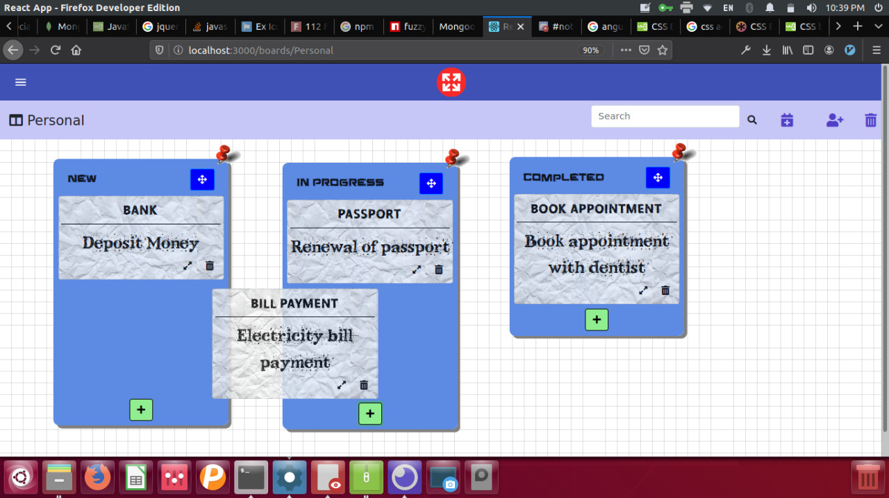

<!-- Project Logo -->
<p align="center">
  <a href="https://github.com/Pranav2612000/colab_tool/">
    

  </a>

  <h3 align="center">to-(gthr)-do</h3>
    Take notes together and arrange them in beautiful ways!! Note-taking and task management was never this fun
  <p align="center">
    <br />
    <a href="https://github.com/Pranav2612000/colab_tool/issues">Report Bug</a>
    ·
    <a href="https://github.com/Pranav2612000/colab_tool/issues">Request Feature</a>
  </p>
</p>
<p align="center">
  <b>to-(gthr)-do is live <a href="https://stormy-woodland-33610.herokuapp.com/login/">here</a>.</b>
</p>
<p align="center">
  
</p>

<!-- TABLE OF CONTENTS -->

## Table of Contents

- [About the Project](#about-the-project)
  - [Built With](#built-with)
- [Getting Started](#getting-started)
  - [Prerequisites](#prerequisites)
  - [Installation](#installation)
- [Usage](#usage)
- [Roadmap](#roadmap)
- [Contributing](#contributing)
- [License](#license)
- [Contributors](#contributors)

<!-- ABOUT THE PROJECT -->

## About The Project

<!-- [![Product Name Screen Shot][product-screenshot]](https://example.com) -->
There are many TODO managing applications, but none of them are as intuitive to use as togthrdo. Togthrdo allows you to create lists, add cards to lists and drag these cards between lists, as other applications. But the reason why toghtrdo is better, is because, it allows users to drag and move lists around on the board - to create meaningful views for managing your tasks.
Some of its features include:
* Allow users to login and register to save their lists and cards
* Create cards which automatically expire after due date
* Customize colors of lists
* Fuzzy search across all lists and cards
* Realistic UI

Watch [this](https://youtu.be/V-zRiwnVuY4) video to see how it works.

### Built With

I have used various libraries/frameworks for this project, the important ones mentioned here:

- MongoDB
- Express
- React
- Node

<!-- GETTING STARTED -->

## Getting Started

To get a local copy up and running follow these simple example steps.

### Prerequisites

You will have to install the following.

- npm

```sh
npm install npm@latest -g
```

### Installation

1. Clone the repo

```sh
git clone https://github.com/Pranav2612000/colab_tool.git
```

2. Install NPM packages for frontend

```sh
npm install
```

3. Start the project

```sh
npm start
```

4. In a new terminal tab, Open the folder backend

```JS
cd backend
```

5. Install NPM packages for backend

```sh
npm install
```

6. Start the server

```JS
nodemon index.js
```

<!-- USAGE EXAMPLES -->

## Usage

In progress

<!-- ROADMAP -->

## Roadmap

See the [open issues](https://github.com/Pranav2612000/colab_tool/issues) for a list of proposed features (and known issues).

<!-- CONTRIBUTING -->

## Contributing

Contributions are what make the open source community such an amazing place to be learn, inspire, and create. Any contributions you make are **greatly appreciated**.

1. Fork the Project
2. Create your Feature Branch (`git checkout -b feature/AmazingFeature`)
3. Commit your Changes (`git commit -m 'Add some AmazingFeature'`)
4. Push to the Branch (`git push origin feature/AmazingFeature`)
5. Open a Pull Request

<!-- LICENSE -->

## License

Distributed under the MIT License. See `LICENSE` for more information.

<!-- CONTACT -->

## Contributors

- [Pranav Joglekar](https://github.com/Pranav2612000/)
- [Yash Kothadiya](https://github.com/yskot1999)
- [Rishi Mundada](https://github.com/rishim1402)

Feel free to create new issues for any problems with installation, bugs, feature requests or to contribute
